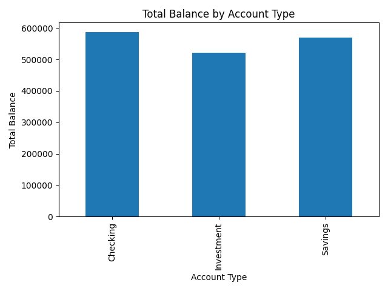

# Bank Pipeline Project

	This project simulates a data pipeline for a bank, processing customer account 
	and transaction data using Python. It cleans, transforms, and visualizes data, 
	generating summary tables and charts.

## Requirements

	- Python 3.10+
	- Pandas
	- Matplotlib
	- SQLite3

## How to Run

	1. Clone the repository:
 	
   	    git clone https://github.com/AhmadJamei/bank-pipeline-project.git

	2.  Change directory to the project folder:
	    
	    cd bank-pipeline-project

	3.  Create a virtual environment:

	    python3 -m venv venv

	4.  Activate the virtual environment:

	    source venv/bin/activate  # Linux/WSL

	5. Install dependencies:

	    pip install -r requirements.txt

	6. Run the main script:

	   python3 scripts/bank_pipeline.py

Output

	Summary tables of customer accounts

	Transaction totals

	Charts visualizing account balances and transactions

Notes

	Sample random data is used for demonstration purposes.

	The 'data' folder contains example input files.

	The project is designed to show data pipeline and visualization skills for HR 	review.

Sample Output	

	The processed data can be visualized in a dashboard created using Excel.  
	Different types of data are collected, cleaned, and then summarized using 
	Pivot Tables, providing interactive insights into customer accounts and 
	transactions.

Total Balance Chart

